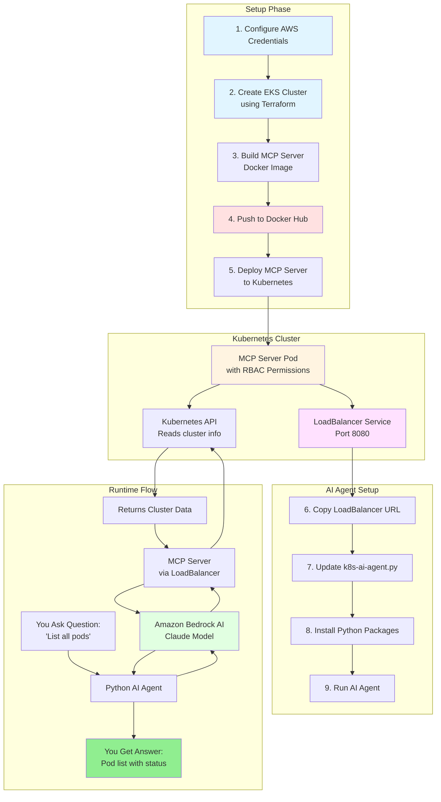

# Kubernetes AI Agent

Talk to your Kubernetes cluster using simple questions!


## What Does This Do?

Ask questions about your Kubernetes cluster in plain English and get answers.

**Examples:**
- "List all my pods"
- "Which pods are running?"
- "Show me my services"

## Prerequisites

Before you start, make sure you have:
- **AWS Account** with credentials (Access Key ID and Secret Access Key)
- **Docker** installed on your computer
- **Terraform** installed (to create the cluster)
- **kubectl** installed (to manage Kubernetes)
- **Python 3.10+** installed
- **Git** installed

## What is MCP Server?

**MCP = Model Context Protocol**

It's a bridge that lets AI talk to Kubernetes. Without MCP, the AI doesn't know how to get information from your cluster.

**Think of it like:** A translator that helps AI and Kubernetes understand each other.

## What is Strands?

A Python tool that connects:
- AI models (Amazon Bedrock)
- Tools (MCP Server)

It makes building AI agents easy!

## How It Works

```
     YOU
      ↓
  AI Agent (Python)
      ↓
  Amazon Bedrock ↔ MCP Server
  (AI Brain)        (Kubernetes Expert)
                         ↓
                    Kubernetes Cluster
```

**Simple Flow:**
1. You ask a question
2. AI Agent sends it to Amazon Bedrock (the smart AI)
3. Bedrock asks MCP Server to get information from Kubernetes
4. MCP Server reads your cluster and returns the data
5. You get your answer!

## Complete Architecture



## Setup Guide

### Step 1: Configure AWS

```bash
aws configure
```

You'll be asked for:
- **AWS Access Key ID**: Your AWS access key
- **AWS Secret Access Key**: Your AWS secret key
- **Default region**: Choose a region (e.g., `us-east-1`)
- **Default output format**: Press Enter (default is fine)

### Step 2: Create EKS Cluster

```bash
cd EKS-cluster
terraform init
terraform plan --var-file=vpc-eks-cluster.tfvars
terraform apply --var-file=vpc-eks-cluster.tfvars
```

⏱️ This takes about 10-15 minutes. Terraform will create your Kubernetes cluster on AWS.

### Step 3: Deploy MCP Server to Kubernetes

#### 3.1 Clone the MCP Server Repository

```bash
git clone https://github.com/containers/kubernetes-mcp-server.git
cd kubernetes-mcp-server
```

#### 3.2 Build and Push Docker Image

```bash
docker build -t your-username/k8s-mcp-server:v1 .
docker push your-username/k8s-mcp-server:v1
```

**Important:** Replace `your-username` with your Docker Hub username.

#### 3.3 Update Deployment File

Open `deployment.yaml` and update the image name:

```yaml
image: your-username/k8s-mcp-server:v1  # Change this to your Docker Hub username
```

#### 3.4 Deploy to Kubernetes

```bash
kubectl apply -f deployment.yaml
```

This creates:
- **Namespace**: `mcp-system` (separate space for MCP server)
- **ServiceAccount**: `mcp-server-sa` (identity for the server)
- **ClusterRole**: Permissions to read/write pods, services, deployments
- **Deployment**: Runs the MCP server pod
- **LoadBalancer**: Makes the server accessible from outside

#### 3.5 Verify Deployment

```bash
kubectl get svc -n mcp-system
kubectl get pods -n mcp-system
```

Wait until the pod status shows `Running` and the LoadBalancer shows an `EXTERNAL-IP`.

**Example output:**
```
NAME         TYPE           EXTERNAL-IP                                                              PORT(S)
mcp-server   LoadBalancer   a1b2c3d4e5f6g7h8i9j0.us-east-1.elb.amazonaws.com                       8080:31234/TCP
```

### Step 4: Setup Python AI Agent

#### 4.1 Copy LoadBalancer URL

Copy the `EXTERNAL-IP` from the previous step.

#### 4.2 Update Agent Configuration

Open `ai-agent/k8s-ai-agent.py` and update:

```python
LOADBALANCER_URL = "http://YOUR-EXTERNAL-IP-HERE:8080/sse"
```

**Example:**
```python
LOADBALANCER_URL = "http://a1b2c3d4e5f6g7h8i9j0.us-east-1.elb.amazonaws.com:8080/sse"
```

#### 4.3 Install Python Packages

```bash
cd ai-agent
uv venv
source .venv/Scripts/activate  # On Windows
# OR
source .venv/bin/activate      # On Mac/Linux

uv pip install -r requirements.txt
```

### Step 5: Run the AI Agent

```bash
python k8s-ai-agent.py
```

## Example Conversation

```
You: List all pods

Agent: Here are your pods in the cluster:
- mcp-server-5f8f798d8d-94bjd (Running)
- nginx-deployment-7d48b9c8f-xk2l9 (Running)
- redis-master-0 (Running)

You: Show me services

Agent: Here are your services:
- mcp-server (LoadBalancer, port 8080)
- kubernetes (ClusterIP, port 443)
- nginx-service (NodePort, port 80)

You: exit
Goodbye!
```

## Project Structure

```
k8s-ai-project/
├── EKS-cluster/         # Terraform files to create Kubernetes cluster
├── k8s-mcp-server/      # MCP Server deployment files
│   └── deployment.yaml  # Kubernetes resources
└── ai-agent/            # Python AI agent
    ├── k8s-ai-agent.py  # Main agent script
    └── requirements.txt # Python dependencies
```

## Troubleshooting

### Problem: "Connection failed to MCP Server"

**Solution:**
```bash
# Check if MCP Server pod is running
kubectl get pods -n mcp-system

# Check pod logs for errors
kubectl logs -n mcp-system -l app=mcp-server

# Verify LoadBalancer has external IP
kubectl get svc -n mcp-system
```

### Problem: "AWS credentials not found"

**Solution:**
```bash
# Reconfigure AWS credentials
aws configure

# Verify credentials
aws sts get-caller-identity
```

### Problem: "Port already in use"

**Solution:**
The MCP server uses port 8080. Make sure no other application is using this port.

### Problem: "Permission denied" errors from MCP Server

**Solution:**
Check if the ClusterRole has correct permissions:
```bash
kubectl describe clusterrole mcp-server-role
```

## Cleanup

To delete everything and avoid AWS charges:

```bash
# Delete MCP Server
kubectl delete -f deployment.yaml

# Delete EKS Cluster
cd EKS-cluster
terraform destroy --var-file=vpc-eks-cluster.tfvars
```

## What You Learned

✅ How to create a Kubernetes cluster on AWS  
✅ How to deploy applications to Kubernetes  
✅ What MCP Server is and how it works  
✅ How to build an AI agent that talks to Kubernetes  
✅ How AI models can interact with cloud infrastructure

## Key Concepts Explained

**Why do we need all these tools?**

- **Terraform**: Creates the Kubernetes cluster automatically (instead of clicking in AWS console)
- **Docker**: Packages the MCP Server so it can run anywhere
- **kubectl**: Command-line tool to manage Kubernetes
- **MCP Server**: The bridge between AI and Kubernetes
- **Strands**: Makes it easy to connect AI models with tools
- **Amazon Bedrock**: The AI brain that understands your questions

---

**Made with ❤️ - Ask your Kubernetes cluster anything!**

**Have questions?** Open an issue on GitHub!
